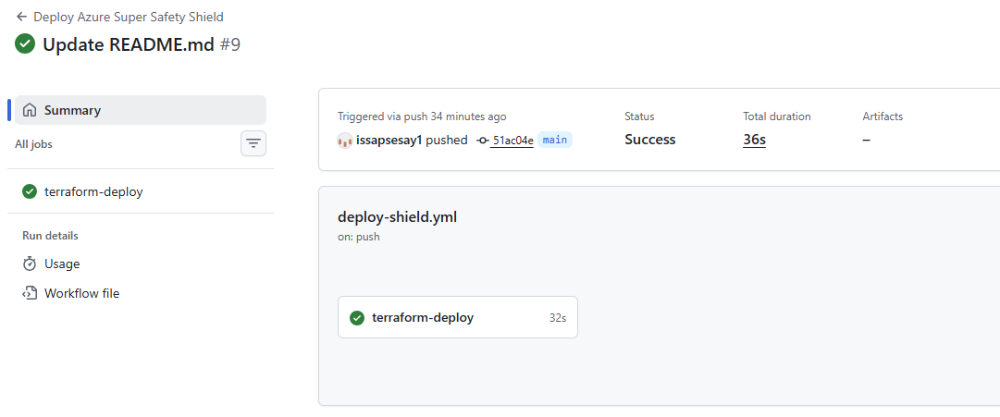
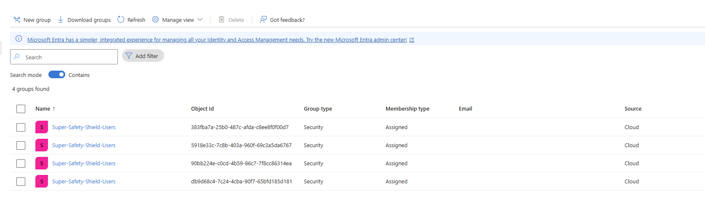

# Azure Enterprise Security-as-Code: The Super Safety Shield

##  Overview
This repository contains a production-ready **Security as Code (SaC)** implementation designed to neutralize unknown, zero-day phishing attacks targeting an enterprise Microsoft cloud ecosystem. 

Instead of manual portal configuration, this architecture relies entirely on automated declarative templates to enforce a secure email defense posture.

## Architecture Design
- **Proactive Interception (Defender Safe Links):** Enforces real-time URL Detonation. When an unknown link is clicked, it pauses execution and detonates the payload in an isolated cloud sandbox to strip-block malicious scripts.
- **Hardening Rules:** Programmatically builds a protected directory group and disables user click-through overrides (`block_user_click_through = true`).

## Tech Stack & Compliance
- **Infrastructure Framework:** Terraform (HashiCorp AzureAD)
- **Target Environments:** Microsoft Defender for Office 365
- **Security Framework Alignment:** NIST SP 800-207 (Zero Trust Email Posture)

## Verification & Operational Proof

### 1. Automated Pipeline Deployment Success
This evidence verifies that the GitHub Actions automation runner securely logs into the Microsoft Cloud tenant and provisions the target resources cleanly via Terraform.
Run Verified: Update README.md #9 (Status: Success)

### 🛡️ 2. Programmatic Perimeter Injection (User Group Verification)
This verification snapshot confirms that the infrastructure-as-code automation successfully provisioned the security baseline target group directly inside the live Azure directory tenant.

